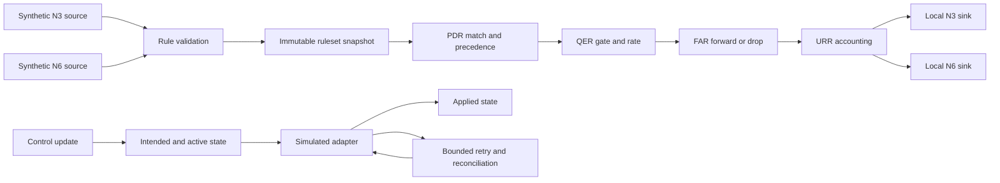
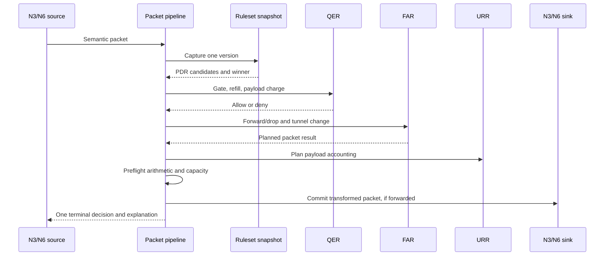

# UPF Rule Pipeline Demo

A deterministic C++11 teaching application that shows how a bounded PFCP-style ruleset changes
synthetic uplink and downlink packet outcomes.

> Simulation-only educational demo; not a conformant or production PFCP, GTP-U, or UPF
> implementation.

## Objective

Explain the PDR, QER, FAR, and URR decision path without an SMF, real UPF, network interface,
socket, or binary protocol. Each run identifies matching candidates, the winning rule, QoS result,
forward/drop action, usage update, semantic tunnel change, and local destination.

## Features

- Synthetic N3 and N6 packet sources and in-memory sinks.
- Deterministic PDR matching; lowest numeric precedence wins.
- QER gate and overflow-safe integer token-bucket enforcement.
- FAR forward/drop with semantic TEID/QFI addition or removal.
- URR payload counters and one threshold report per generation.
- Immutable ruleset snapshots with intended, active, and applied versions.
- Bounded queues, fair scheduling, simulated failures, retries, and reconciliation.
- Equivalent human-readable and JSON results.
- Unit, contract, scenario, property, fuzz, sanitizer, and coverage checks.

## Architecture



The `upf_core` library owns semantic values and policy behavior. Narrow clock, adapter, event, and
packet-sink interfaces isolate deterministic in-process adapters. The CLI only composes these parts.

## Packet Call Flow



A packet never observes mixed ruleset versions. Runtime changes, report creation, sink insertion,
and the terminal result are preflighted before commit.

## Design Plan

| Area | Decision |
|---|---|
| Language | C++11 for production and tests; no C++17 exception required. |
| Build | CMake 3.16+, warnings as errors, GCC 11+ or Clang 14+. |
| Dependencies | nlohmann/json 3.11.3 and Catch2 2.13.10, pinned by archive hash. |
| State | In-memory, bounded, immutable rule configuration with separate QER/URR runtime state. |
| Scheduling | Single-threaded FIFO queues served round-robin for deterministic fairness. |
| Arithmetic | Checked unsigned integers; simulated time uses integer microseconds. |
| QoS | Gate, refill, then charge. Zero rate spends only the initial burst; zero burst permits none. |
| Usage | Count original payload bytes after QER allowance and FAR resolution, including FAR drops. |
| Recovery | Retry transient failures only; stale work cannot replace the latest intended version. |
| Standards | Release 18: TS 29.244 v18.10.0, TS 29.281 v18.4.0, TS 23.501 v18.12.0, TS 23.502 v18.14.0. |

Binary PFCP/GTP-U, sockets, BAR, NAT, ULCL, mobility, charging, persistence, and production
performance claims are outside scope.

## Contracts

The executable supports exactly one input mode:

```text
upf-rule-pipeline-demo --scenario <name> [--output human|json]
upf-rule-pipeline-demo --rules <rules.json> --packets <packets.json> [--output human|json]
```

| Contract | Meaning |
|---|---|
| [rules.schema.json](contracts/rules.schema.json) | Session, capacity limits, and PDR/FAR/QER/URR definitions. |
| [packets.schema.json](contracts/packets.schema.json) | Synthetic packets, simulated time, adapter outcomes, retry, and shutdown input. |
| [result.schema.json](contracts/result.schema.json) | Decisions, candidates, QER/FAR/URR facts, reports, state, events, and sink packets. |

The schemas use JSON Schema Draft 2020-12. Input rejects unknown fields, invalid ranges, missing
references, incompatible directions, and capacity violations before activation. Optional result
facts are explicit `null` values; required collections remain present when empty.

Stable scenarios are `uplink-forward`, `downlink-forward`, `pdr-precedence`, `qer-rate-limit`,
`urr-threshold`, and `adapter-failure`. Additional overload, recovery, queue, and shutdown scenarios
exercise resilience behavior.

Exit codes are `0` for a completed run, `2` for invalid CLI usage, `3` for unreadable input, `4` for
validation failure, and `5` for an invariant or arithmetic failure. Policy drops and no-match results
are normal run outcomes.

## Learner Evaluation Contract

The manual acceptance check measures whether the human output communicates the packet decision:

1. Fix one cohort of exactly 20 people who have not seen or contributed to the demo.
2. Show every participant the same hashed `uplink-forward` human output and no other material.
3. Allow at most five minutes to identify the selected PDR, QER outcome, FAR action, URR packet/byte
   change, and final sink.
4. A participant passes only if all five answers are correct without coaching.
5. The gate passes when at least 18 of 20 participants pass.

Record only participant codes, eligibility, answers, elapsed time, help flag, result, tested build,
output hash, date, facilitator code, and aggregate score. Do not collect names or network/subscriber
data. A failed cohort blocks completion but does not invalidate automated correctness results.

## Build and Run

```sh
cmake -S . -B build -DCMAKE_BUILD_TYPE=Debug
cmake --build build --parallel
ctest --test-dir build --output-on-failure

./build/upf-rule-pipeline-demo --scenario uplink-forward --output human
./build/upf-rule-pipeline-demo --scenario downlink-forward --output json
./build/upf-rule-pipeline-demo \
  --rules examples/uplink-rules.json \
  --packets examples/uplink-packets.json \
  --output json
```

## Quality Gates

- Same-input scenario output is identical across 1,000 runs.
- At least 100,000 packet/update interleavings expose no mixed snapshot.
- AddressSanitizer and UndefinedBehaviorSanitizer pass.
- Static analysis, format checks, and 10,000 fuzz iterations pass.
- Domain/application branch coverage is at least 90% (currently 91%).
- Modeled standards behavior maps to a selected clause or an explicit exclusion.
